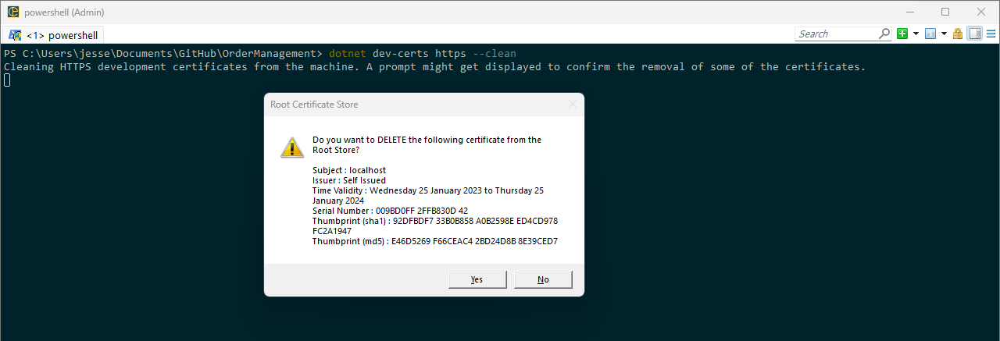
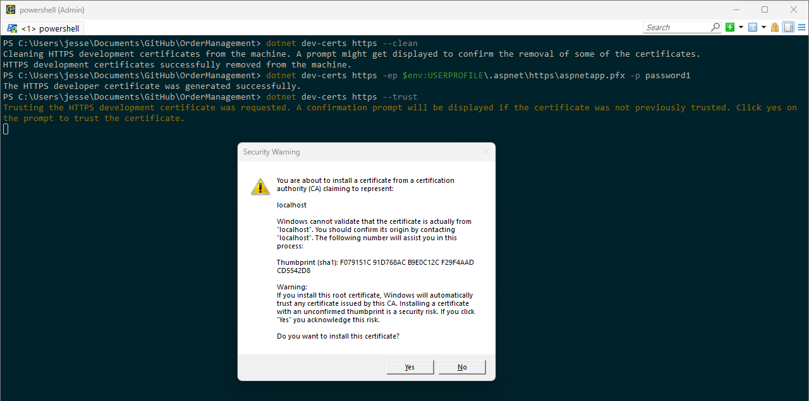
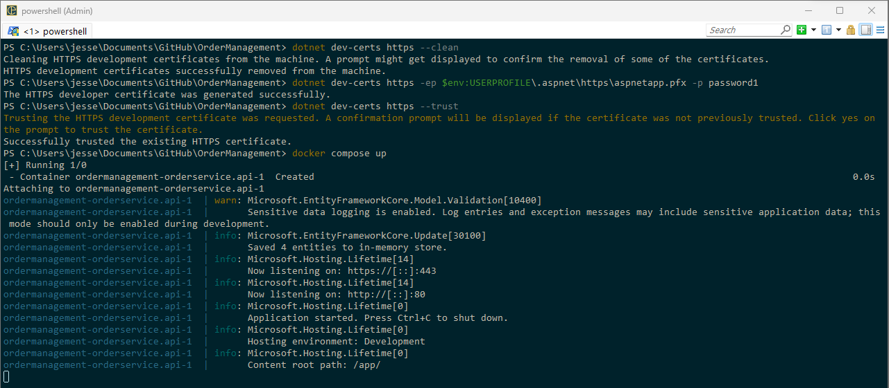
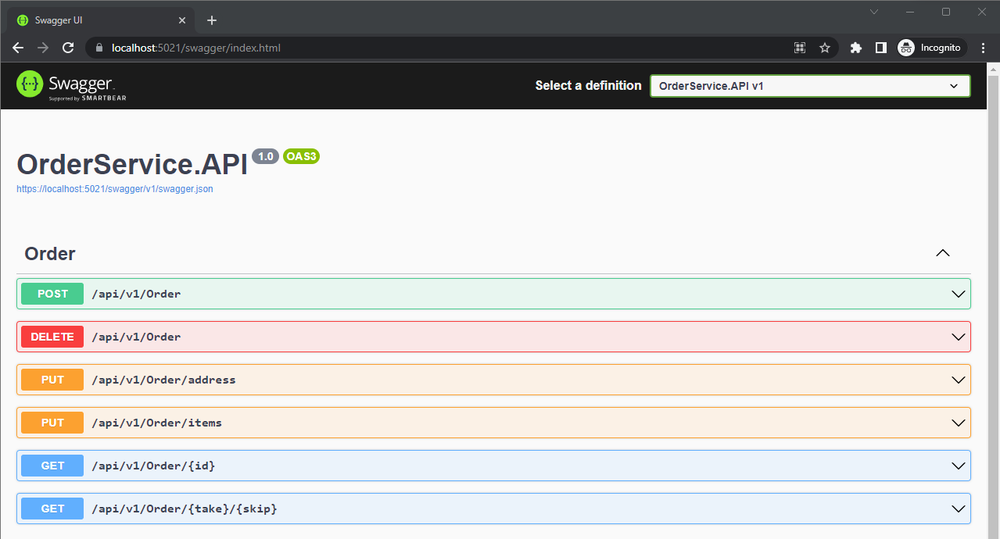

# Order Management API
This application is designed to run on a Docker environment over a HTTPS connection using a self-signed certificate.
To create the self-signed certificate please follow the steps below:

## Generating the local Self-Signed SSL Certificate
To be able to run the application over HTTPS you must create a self-signed
certificate following the next steps:

1 - In a Powershell command window execute:
- `dotnet dev-certs https --clean`
- ***WARNING:*** When clicking on YES you will delete the existing self-signed certificate, but you can create a new one any time following the steps below:

- `dotnet dev-certs https -ep $env:USERPROFILE\.aspnet\https\execution.pfx -p password1`
- `dotnet dev-certs https --trust`
- Click Yes on the new window that opened to trust the new certificate

You are ready to run the application: `docker compose up`

Based on this article: [https://docs.microsoft.com/en-us/aspnet/core/security/docker-https?view=aspnetcore-6.0](https://docs.microsoft.com/en-us/aspnet/core/security/docker-https?view=aspnetcore-6.0)

## Running the application on Docker Desktop
After created the self-signed certificate you need to follow the next steps in order to run the application:
- Navigate to the application base directory where the docker compose file is. In my case: `C:\Users\jesse\Documents\GitHub\OrderManagement`

Execute the following command to run the application:

`docker compose up`

If everything goes OK you will see in your screen information similar to this:

***Congratulations*** The application is ready to go on this link
https://localhost:5021/swagger/index.html

If everything went OK you will see the Swagger Home UI as in the image below:

# Open API (Swagger)

You can test our APIs using swagger in this way:

1- Open the base API URL and add */swagger* to it. For example if you are
running the API locally your URL would be something like:
*https://localhost:5021/swagger/index.html*.

2 - A list of API should be shown. Choose the Endpoint you want to test and
click on the *Arrow pointing down* to expand the specifics of that Endpoint.

3 - Click on *Try it out* button, inform all the required parameters and
click on *Execute*. After that you should see the results.